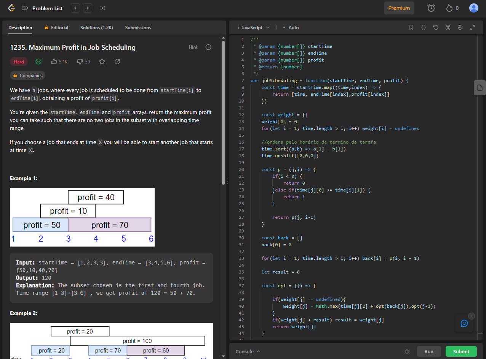
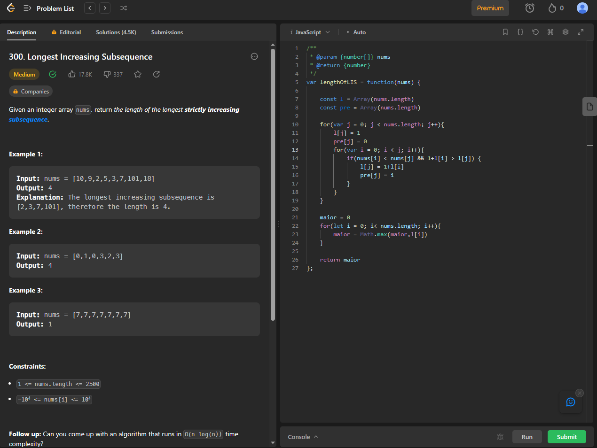

# Exercicios PD - LeetCode

**Número da Lista**: 5 
**Conteúdo da Disciplina**: PD (Programação Dinâmica) 

## Alunos
|Matrícula | Aluno |
| -- | -- |
| 20/0028677  |  Vitor Manoel Aquino de Brito |

## Sobre 
Este repositório contém a resolução de 2 exercicios relacionados a Programação dinâmica, contemplando os algoritmos de Weigthed Interval scheduling e maior subsequência crescente. Os Exercicios realizados foram retirados do [LeetCode](https://leetcode.com/)

## [Link da Apresentação]()

## Screenshots

### Exercicio 1 - Maximum Profit in Job Scheduling

Link: [Maximum Profit in Job Scheduling](https://leetcode.com/problems/maximum-profit-in-job-scheduling/description/)  
Dificuldade: Difícil

### Exercício 2 - Longest Increasing Subsequence

Link: [Longest Increasing Subsequence
](https://leetcode.com/problems/longest-increasing-subsequence/description/) 
Dificuldade: Médio

## Instalação 
**Linguagem**: JavaScript 

Caso queira testar localmente é necessário ter o nodeJS instalado

## Uso 

Para verificar o funcionamento basta abrir o link do exercicio e copiar o código referente a questão, e logo após realizar o envio (caso esteja o console.log no final, basta trocá-lo pelo return seguido da variável). Caso queira verificar localmente, é necessário executar o programa, e para isto basta utilizar o comando:

`node NomeDoArquivo.js`.

